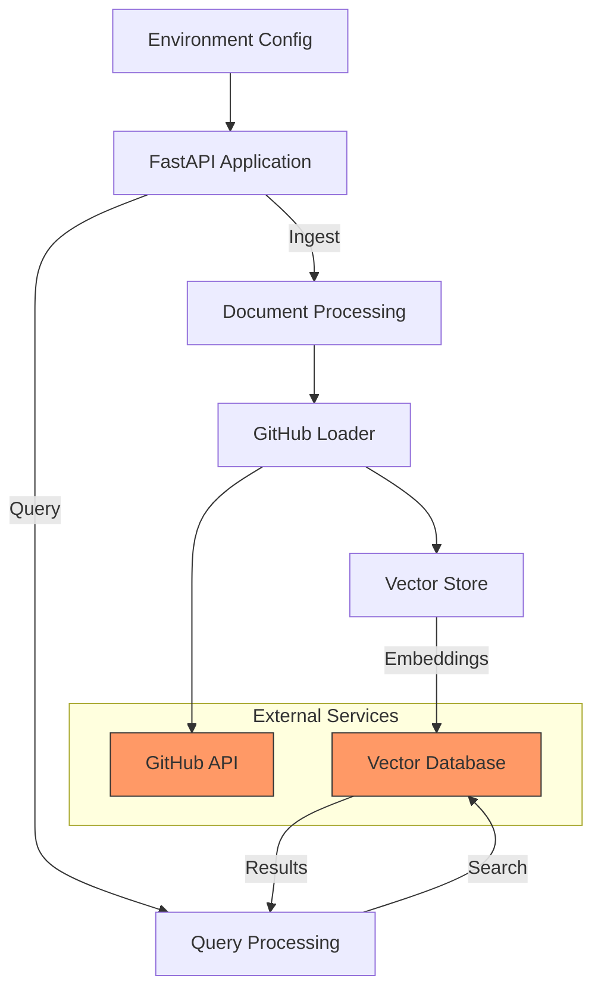

# libscribe

libscribe is a tool for ingesting and processing code repositories, primarily from GitHub, and storing them in a vector database.

## Key Features

- Ingests repositories from GitHub.
- Processes the repository content.
- Stores the processed data in a vector database.

## Architecture



The diagram above illustrates the system's architecture and data flow:

1. The FastAPI application handles both ingestion and query requests
2. A background task is created to handle the ingestion process
3. LangChain's GitHub Loader fetches and filters repository content
4. Documents are enriched with metadata (owner, repo, branch, etc.)
5. The vector store pipeline:
   - Generates embeddings using VoyageAI
   - Stores vectors in Qdrant DB
6. The query pipeline:
   - Processes search queries
   - Performs similarity search in Qdrant
   - Returns relevant documents
7. External services (GitHub, VoyageAI, Qdrant) are integrated via API keys

## Usage

To ingest a repository, you can use the `ingest_repository` function in `src/app/main.py`. Provide the repository URL and branch as input.

## File Structure

The `src` directory contains the following subdirectories:

- `app`: Contains the main application logic, including the API endpoints.
- `ingestion`: Contains the logic for ingesting data from GitHub and processing it.
- `storage`: Contains the logic for interacting with the vector database.
- `utils`: Contains utility functions, such as parsing repository URLs.

## Running the Project

1.  Install UV.

```bash
curl -LsSf https://astral.sh/uv/install.sh | sh
```

2.  Install dependencies using `uv sync`.
3.  Create a `.env` file based on the `.env.example`.
4.  Run the FastAPI application using `uvicorn src.app.main:app --reload`.

## Roadmap

For more details about future plans, please refer to the `ROADMAP.md` file.
